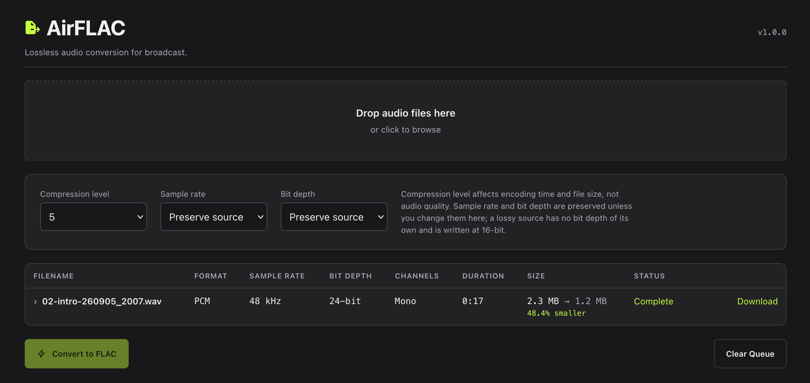
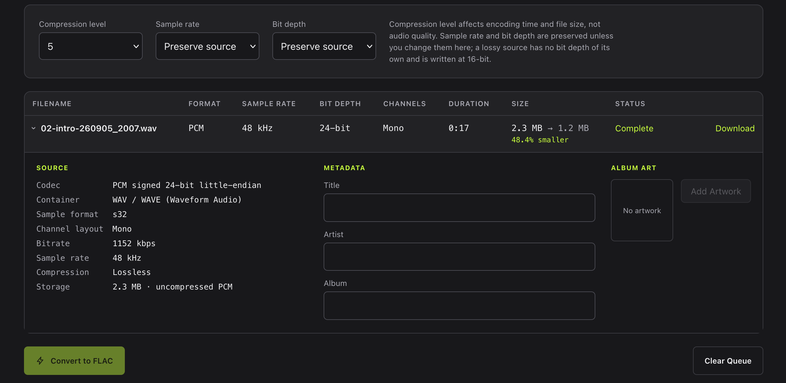

# AirFLAC

A free, open-source, self-hosted tool for radio stations to convert audio to lossless FLAC for compatible broadcast automation systems.

## Overview

AirFLAC is a small web utility for radio stations and broadcast engineers. Drop audio files into a browser, see exactly what they are, correct the metadata, and convert them to FLAC.

It runs on your own server. There are no accounts, no subscriptions, no cloud services, no telemetry and no tracking. Uploaded audio is deleted automatically after 24 hours by default.

The whole application is one Node.js process and FFmpeg. There is no database to run or maintain.

## Screenshots





## Features

- Drag-and-drop upload, single files or large batches
- Server-side inspection with `ffprobe`: codec, container, sample rate, bit depth, channels, duration, bitrate and existing metadata
- Lossless or lossy determined from the actual codec, never the file extension
- Edit Title, Artist and Album; keep, replace, add or remove album art
- Faithful conversion to FLAC — no resampling, gain, loudness or dynamics processing unless you explicitly ask for it
- Already-FLAC sources have their metadata rewritten without re-encoding the audio
- Real conversion progress from FFmpeg, not an invented percentage
- Download files individually, or the whole batch as a ZIP under the original filenames
- Automatic cleanup of temporary files
- Installs natively on Ubuntu or Debian 13+, or runs in Docker

## Why AirFLAC?

Many modern radio automation systems can play FLAC. Where they can, FLAC gives you bit-for-bit identical audio to the source PCM while usually taking noticeably less storage than an uncompressed WAV — often in the region of 40–60% smaller for typical programme material, though the real figure depends entirely on the audio.

**Not every automation platform supports FLAC, and support sometimes varies between versions or between the playout and production sides of the same product.** Check your own system's documentation and test a handful of files in your actual on-air environment before converting a library.

## Supported formats

AirFLAC accepts anything FFmpeg can decode. In practice that includes:

**Lossless sources** — WAV / PCM, BWF, FLAC, AIFF, ALAC

**Lossy sources** — MP3, AAC, M4A containing AAC, OGG Vorbis, Opus, WMA

Output is always FLAC in v1.

Whether a file is lossless is decided by inspecting the audio stream, not by looking at the filename. This matters more than it sounds:

```
song.m4a containing AAC   = lossy
song.m4a containing ALAC  = lossless
```

Both have the same extension. Only the codec inside tells you which is which.

## Metadata

AirFLAC reads and writes four fields:

- Title
- Artist
- Album
- Album art

Existing metadata is read from the source file and shown before conversion. Anything you do not edit is carried through to the FLAC as-is. Tags are written as standard Vorbis comments (`TITLE`, `ARTIST`, `ALBUM`), and album art is embedded in a native FLAC `PICTURE` block typed as front cover.

Album art can be JPEG or PNG. If the source already has artwork it is kept by default; you can replace it, remove it, or add art to a file that has none. Artwork is embedded without being re-encoded.

CART chunks, BEXT and other broadcast-specific metadata are **not** supported in v1. AirFLAC does not attempt to put RIFF CART data inside FLAC files.

### Already-FLAC sources

If you upload a file that is already FLAC and you leave sample rate and bit depth set to "Preserve source", AirFLAC rewrites only the metadata and copies the audio stream untouched. Nothing is re-encoded. Choosing a different sample rate or bit depth is treated as an explicit request to re-encode.

## Lossy source warning

Upload an MP3 and AirFLAC will have something to say about it. The warning appears once per browser session and never blocks the conversion — if you know what you're doing, carry on.

It exists because of a genuine and common misunderstanding:

> Converting MP3, AAC, Opus, or another lossy format to FLAC does not restore audio that was discarded during the original lossy encoding. The resulting FLAC is lossless only with respect to the already-lossy source.

A FLAC made from a 128 kbps MP3 contains exactly the same audible information as that MP3. It is simply a larger file holding the same compromised audio. There are legitimate reasons to do it — an automation system that only ingests FLAC, for instance — but improving quality is not one of them.

## Installing on Ubuntu or Debian

Tested on current Ubuntu releases and Debian 13 (trixie) or newer. You need root access.

```bash
curl -fsSL https://raw.githubusercontent.com/thetylerwoodwardproject/airflac-server/main/scripts/bootstrap.sh | sudo bash
```

That clones the repository to `/usr/local/src/airflac` and runs the installer from it.

If you would rather read the script before running it as root — a reasonable habit, and the reason the
installer is a plain file in this repository rather than something minified — download it first, or skip
it entirely and clone by hand:

```bash
# Read it, then run it
curl -fsSL https://raw.githubusercontent.com/thetylerwoodwardproject/airflac-server/main/scripts/bootstrap.sh -o bootstrap.sh
less bootstrap.sh
sudo bash bootstrap.sh

# Or do the same thing yourself
git clone https://github.com/thetylerwoodwardproject/airflac-server.git
cd airflac-server
sudo ./scripts/install.sh
```

To install a specific version rather than the tip of `main`, set `AIRFLAC_REF` to a tag, branch or commit,
and `AIRFLAC_SRC_DIR` to put the checkout somewhere else:

```bash
curl -fsSL .../bootstrap.sh | sudo AIRFLAC_REF=v1.0.0 bash
```

The installer checks the distribution, installs FFmpeg from the package repositories, installs a current Node.js LTS from NodeSource if the system one is too old, creates an `airflac` service account, builds the application, and starts it under systemd.

When it finishes it prints the URL, typically `http://your-server-ip:8080`.

| Path | Purpose |
| --- | --- |
| `/opt/airflac` | Application files |
| `/etc/airflac/airflac.env` | Configuration |
| `/var/lib/airflac` | Uploaded and converted audio |

### Managing the service

```bash
sudo systemctl status airflac
sudo systemctl restart airflac
sudo systemctl stop airflac
sudo systemctl start airflac

journalctl -u airflac          # logs
journalctl -u airflac -f       # follow logs
```

### Installing dependencies yourself

If you would rather not let the installer do it:

```bash
sudo apt update
sudo apt install -y ffmpeg curl ca-certificates
```

Node.js 22 or newer is required. The version in older distribution repositories is usually too old; install a current LTS from [NodeSource](https://github.com/nodesource/distributions) or your preferred method.

## Installing with Docker

```bash
git clone https://github.com/thetylerwoodwardproject/airflac-server.git
cd airflac-server
docker compose up -d
```

AirFLAC is then at `http://your-server-ip:8080`.

```bash
docker compose logs -f     # logs
docker compose down        # stop
```

To update after pulling new code:

```bash
git pull
docker compose up -d --build
```

Audio lives in the `airflac-data` volume mounted at `/data`, so it survives container restarts. Retention cleanup still removes expired files.

## Configuration

Configuration is entirely environment variables. **AirFLAC runs correctly with no configuration at all** — every value below has a working default.

For a native install, edit `/etc/airflac/airflac.env` and run `sudo systemctl restart airflac`. For Docker, set them under `environment:` in `docker-compose.yml`. See `.env.example` for a copy of this list.

| Variable | Default | Purpose |
| --- | --- | --- |
| `AIRFLAC_HOST` | `0.0.0.0` | Interface to bind to |
| `AIRFLAC_PORT` | `8080` | Port to listen on |
| `AIRFLAC_MAX_UPLOAD_MB` | `1000` | Largest accepted single file |
| `AIRFLAC_FILE_RETENTION_HOURS` | `24` | How long audio is kept before cleanup |
| `AIRFLAC_FLAC_COMPRESSION_LEVEL` | `5` | Default compression level (0–12) |
| `AIRFLAC_STORAGE_PATH` | `./storage` | Where audio is written |
| `AIRFLAC_MAX_CONCURRENT_CONVERSIONS` | `2` | Files converted at once |
| `AIRFLAC_MAX_ARTWORK_MB` | `10` | Largest accepted album art image |
| `AIRFLAC_TRUST_PROXY` | `false` | Read client IPs from `X-Forwarded-For` |
| `AIRFLAC_LOG_LEVEL` | `info` | `debug`, `info`, `warn` or `error` |

## Usage

1. Drop audio files onto the page, or click to browse. Batches are fine.
2. Each file is inspected as it arrives. The queue shows format, sample rate, bit depth, channels, duration and size.
3. Click a filename to expand it: full technical detail, the metadata editor and album art.
4. Adjust the conversion settings if you need to. The defaults are correct for most work.
5. Press **Convert to FLAC**.
6. Download files individually, or use **Download All** for a ZIP of the batch.

Downloads keep your original filenames:

```
Station Promo Final.wav  ->  Station Promo Final.flac
```

### Conversion settings

**Compression level (0–12, default 5).** Affects encoding time and file size only. Every level produces bit-identical audio on decode — a level 12 FLAC does not sound better than a level 0 FLAC, it just took longer to make and is slightly smaller.

**Sample rate (default: preserve source).** Leave it alone unless your automation system requires a specific rate. Resampling is a real change to the audio.

**Bit depth (default: preserve source).** As above. Reducing depth discards information.

A lossy source is the one exception. MP3, AAC, Vorbis and Opus decode to float and have no bit depth
to preserve, so AirFLAC writes them at 16-bit rather than letting FFmpeg default to 24-bit and
tripling the file for no added information. Pick a depth explicitly if you want something else.

The queue is shared: everyone with the page open sees the same files, and **Clear Queue** clears it for all of them.

### Checking an install

`scripts/smoke-test.sh` puts a generated test tone through the whole path — upload, inspection,
conversion, download — and verifies the result really is a FLAC with the metadata written:

```bash
./scripts/smoke-test.sh http://localhost:8080
```

It needs `curl` and `ffmpeg`, clears the queue after itself, and exits non-zero if anything fails.
CI runs the same script against both the Docker image and a real systemd install.

## Updating

Native install — from the source checkout, which is `/usr/local/src/airflac` if you used the one-step installer:

```bash
cd /usr/local/src/airflac
sudo git pull
sudo ./scripts/update.sh
```

Your configuration in `/etc/airflac` and your audio in `/var/lib/airflac` are preserved. The old configuration file is backed up alongside itself before anything changes.

Run `update.sh` from the source checkout, not from `/opt/airflac`. The installer replaces `/opt/airflac`
wholesale, so updating from inside it would delete the tree it is copying from; the script refuses to do
that and tells you where to run it instead.

Docker:

```bash
git pull
docker compose up -d --build
```

## Uninstalling

```bash
sudo ./scripts/uninstall.sh
```

The service and application files are removed. You are asked separately before anything in `/var/lib/airflac` or `/etc/airflac` is deleted, and the default answer for both is to keep them — a non-interactive run never destroys audio or configuration. FFmpeg and Node.js are left installed.

For Docker:

```bash
docker compose down          # keeps the audio volume
docker compose down -v       # also deletes the audio volume
```

## Security

**AirFLAC does not provide built-in authentication. If it is exposed outside a trusted network, place it behind an authenticated reverse proxy or other access control.**

Do not put an unauthenticated converter directly on the public Internet. Anyone who can reach it can upload files, consume your CPU and disk, and download anything in the shared queue.

AirFLAC works behind Nginx, Caddy and Traefik without needing any of them. If you do run one, set `AIRFLAC_TRUST_PROXY=true` so client addresses are logged correctly, and make sure your proxy does not buffer `text/event-stream` responses or progress updates will arrive in bursts. Allow a request body large enough for your uploads — Nginx's `client_max_body_size` defaults to 1 MB, which is far too small.

Within the application:

- Every uploaded file is treated as untrusted and inspected with `ffprobe`
- FFmpeg is always invoked with an argument array, never a shell string, and never with arguments supplied by the client
- Uploads are stored under generated UUIDs; user-supplied filenames are never used as filesystem paths
- Filesystem paths, internal identifiers, raw FFmpeg output and stack traces are never sent to the browser
- Upload and artwork sizes are capped server-side
- Album art is validated by its actual file signature, not its declared type

## Troubleshooting

**"FFmpeg could not read this file."** — FFmpeg could not decode it. It may be corrupt, or not actually audio. Check with `ffprobe yourfile.wav`.

**The health check reports `ffmpeg: false`.** — FFmpeg is not installed or not on the service's `PATH`. Install it with `sudo apt install ffmpeg` and restart AirFLAC. Check the current state at `http://your-server:8080/api/health`.

**"The uploaded file exceeds the configured size limit."** — Raise `AIRFLAC_MAX_UPLOAD_MB` and restart. If you are behind a reverse proxy, raise its body size limit too.

**My FLAC is bigger than the MP3 it came from.** — Expected. A lossy file is small because information was thrown away, and no lossless format can store the result as compactly. AirFLAC writes lossy sources at 16-bit so the output stays as small as it reasonably can, and reports the increase honestly rather than calling it a saving. Nothing has gone wrong, and the FLAC does not sound worse than the MP3 — it just isn't smaller.

**Progress sits on "Converting" without a percentage.** — AirFLAC could not determine the source duration reliably, so it shows the state rather than inventing a number. The conversion is still running.

**Nothing updates until I reload the page.** — The browser is not receiving the event stream. This is almost always a reverse proxy buffering `text/event-stream`; disable buffering for the `/api/events` endpoint.

**The service will not start.** — `journalctl -u airflac -n 50 --no-pager` will say why. A common cause is `AIRFLAC_STORAGE_PATH` pointing somewhere the `airflac` user cannot write.

## Development

```bash
npm install
npm run dev      # client on :5173, server on :8080
```

Other scripts:

```bash
npm run build    # build everything for production
npm start        # run the production server
npm run lint     # eslint and svelte-check
npm test         # vitest
```

The test suite generates its own small audio fixtures with FFmpeg, so FFmpeg must be installed to run it. No audio is committed to the repository.

Layout:

```
shared/   types and codec classification used by both sides
server/   Express API, FFmpeg and ffprobe services
client/   Svelte 5 interface
scripts/  install, update and uninstall
systemd/  service unit
```

## Contributing

Bug reports and pull requests are welcome.

AirFLAC is deliberately small. It is meant to do one job reliably rather than grow into a general-purpose audio platform, so changes that keep it simple are the ones most likely to be merged. Before adding a feature, it is worth opening an issue to talk about it.

Please make sure `npm run lint` and `npm test` both pass.

## License

MIT. See [LICENSE](LICENSE).
